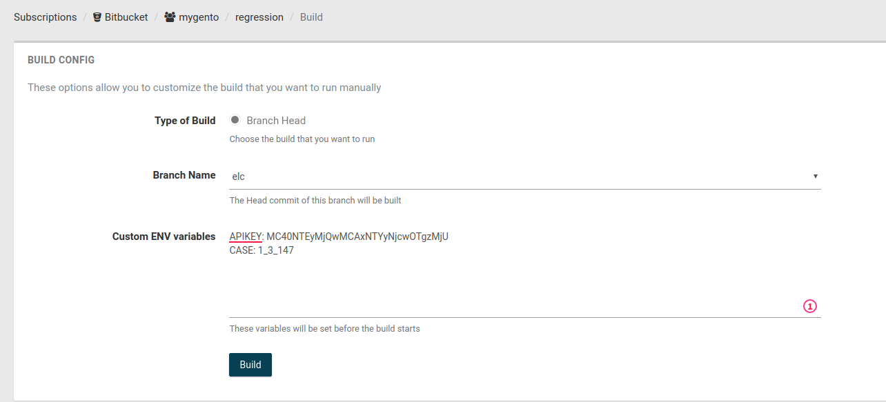

**_Создание Тестов:_**

Связь теста и тест кейса из QA:

Необходимо сопоставить ключевые слова в аннотации _@Title("string")_ к методу теста и в поле "_Codeception mapping"_ тест кейса QA:

**Пример**:
В первом тест кейсе QA у нас есть ключевое слово "_MappingTestCase_".
Есть класс _FirstCest.php_ и есть метод _logInSearchWord_:

```
<?php

use Yandex\Allure\Adapter\Annotation\Title;

class FirstCest
{
    /**
     * @Title("MappingTestCase")
     * @param AcceptanceTester $I
     */
    public function logInSearchWord(AcceptanceTester $I)
    {
        ...
    }
}
```
В результате этой работы мы сможем загрузить xml отчет Allure, который присоединит необходимый кейс.

**_Скачивание переменных из QA и их использование:_**

_Скачать переменные_ (data) из кейсов QA можно по роуту:

GET https://qa.cloud.mygento.net/api/case_config

Параметры:

* apiKey (string) - Этот ключ можно скопировать внутри плана QA
* testCases (string) - Через ниженее подчеркивание "_" указать Id необходимых кейсов QA. Например: 1_2_4_999
* run (integer) - Указать id testRun для получения глобальных переменных. Если отсутствует возмет переменные - production 

В ответ мы получим файл env.json, в котором будут лежать переменные (data) из всех указанных кейсов, c ключом указанном 
в поле "Codeception mapping", если в поле пусто переменные будут лежать без вложенностей.
Следите за тем, чтобы в выбранных кейсах переменные не повторялись.

В shippable.yml блок build в ci, это будет выглядеть примерно так:
```
build:
  ci:
    - wget "https://qa.cloud.mygento.net/api/case_config?apiKey=${APIKEY}&testCases=${CASE}" -O env.json
```
гдe ${APIKEY} и ${CASE} будут задаваться в env при ручном билде из shippble



**_Использование переменных в тестах_**:


Для получения какой-то конкретной переменной сначала в методе нужно спарсить полученный файл:

Можно использовать метод prepareTest, который доступен по пути Helper\Acceptance. В ответе
мы получим объект с переменными из кейсов QA
```
<?php

use Helper\Parser;

/**
 * Class FirstCest
 */
class FirstCest
{
    /**
     * @Title("TestMap")
     * @param AcceptanceTester $I
     */
    public function logInSearchWord(AcceptanceTester $I, Acceptance $acceptance, Scenario $scenario)
    {
        $this->testName = $scenario->current('name');
        $this->config = $acceptance->prepareTest($I, $this->testName);
        ...

    }
}
```

И далее начать их использовать, обращаясь к ключу, 
```
$I->see($this->config[$this->testName]['element']);
```

либо

```
$I->see($this->config['url']);
```

**_Запуск тестов и их сохранение в QA:_**

Когда все настройки сделаны, тесты написаны, приступаем к конфигурации shippable.yml:

* Скачиваем переменные и запускаем тесты:

```
ci:
  - wget "https://qa.cloud.mygento.net/api/case_config?apiKey=${APIKEY}&testCases=${CASE}" -O env.json
  - codecept run acceptance -vvv -d --env chromeheadless  --xml=../../shippable/testresults/result.xml
```

* Добавим путь к отчету сформированному в xml в переменную. Сгенерируем отчет Allure,
добавим его в архив и так же получим путь к zip файлу.

```
always:
  - pathXml=$(find . -path '*/tests/_output/allure-results/*.xml')
  - allure generate ./tests/_output/allure-results --clean -o ./tests/_output/allure-reports
  - cd ./tests/_output/allure-reports
  - zip -r AllureReport.zip ./*
  - cd ../../../
  - pathAllure=$(find . -path '*/tests/_output/allure-reports/AllureReport.zip')
```
_Обратите внимание, что Zip архив должен в корне содержать файл index.html._

* Отправим наши результаты в QA.

На роут:
POST https://qa.cloud.mygento.net/api/upload_report/xml

Параменты:

* xmlFile (file) - Файл формата .xml
* allureFile (file) - Файл формата .zip.
* apiKey (string) - Этот ключ можно скопировать внутри плана QA.
* run (integer) - Номер рана. Если не указан будет создан.
* name (string) - Наименование TestRun. Если не указан буден присвоен "Автотест". ВНИМАНИЕ: Если 'run' указан, то переименует.

```  
  - curl -X POST https://qa.cloud.mygento.net/api/upload_report/xml -H "content-type:multipart/form-data" -F xmlFile=@${pathXml} -F allureFile=@${pathAllure} -F apiKey=${APIKEY}
```

Если вы сделали все правильно, то отчет появится в тест плане QA

**_Запуск тестов_**

Локально (если chromedriver и composer установлены): 
```
codecept run acceptance CartCest:deleteAllInCartTest -vvv -d  -f --env chrome
для запуска тестового метода из определенного теста [имятеста:тестовый_метод]

codecept run acceptance LoginCest -vvv -d  -f --env chrome
для запуска все тестов логина

codecept run acceptance -vvv -d  -f --env chrome
всех тестов в сьюте acceptance (папка в /tests)

codecept run acceptance -vvv --env chrome tests/acceptanceBDD/LoginGV.feature
запуск теста не располложенного в папке acceptance
```

Опции запуска:
```
-f не продолжать прохождение тестов после первой ошибки
-vvv -d подробная информация о прохождении теста
--env chromeheadless конфигурация хрома в acceptance.suite.yml для запуска  в хедлесс режиме
```
